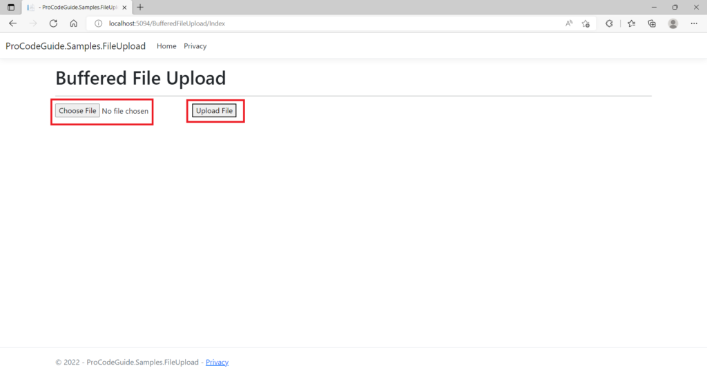
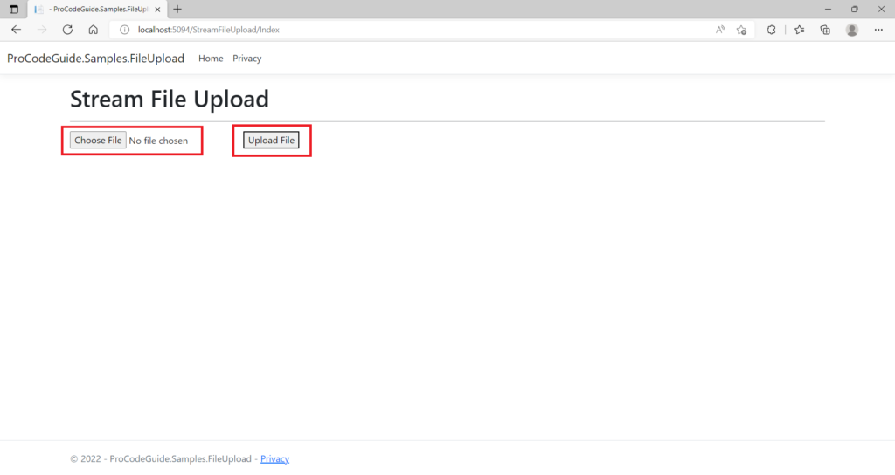

# 1. Tổng quan
Tính năng tải lên tệp (file upload) cho phép người dùng đưa các file từ máy tính cá nhân hoặc mạng nội bộ lên ứng dụng web. Ứng dụng sẽ xử lý, kiểm tra và lưu trữ các file này vào các hệ thống như bộ nhớ cục bộ, lưu trữ đám mây hoặc cơ sở dữ liệu.

Ứng dụng phổ biến:
- Upload ảnh đại diện
- Tải lên các tài liệu xác minh danh tính (KYC) như ảnh, chữ ký
- Nhập liệu hàng loạt từ file CSV/XML thay vì nhập thủ công từng bản ghi

Cách triển khai trong ASP.NET Core MVC:
- Sử dụng IFormFile - một interface trong namespace Microsoft.AspNetCore.Http để xử lý một hoặc nhiều file.
- Hỗ trợ 2 phương thức:
  - Buffered model binding (Buộc model đệm): Dành cho các file có kích thước nhỏ.
  - Unbuffered streaming (Truyền trực tiếp không đệm): Dành cho các file lớn.

---
# 2. Các phương thức tải lên tệp
Có hai phương thức khả dụng để thực hiện tải lên tệp trong ASP.NET Core:
- Buffering (Đệm):
  - Sử dụng đối tượng IFormFile để đọc toàn bộ file vào bộ nhớ hoặc đĩa tạm.
  - Nhược điểm: Có thể gây tốn nhiều tài nguyên (bộ nhớ, đĩa) nếu có nhiều file lớn được tải lên cùng lúc.
  - Phù hợp nhất cho các file nhỏ. File > 64KB sẽ được ghi ra đĩa tạm.
- Streaming (Truyền trực tiếp):
  - File được xử lý trực tiếp mà không cần đọc toàn bộ vào bộ nhớ trước.
  - Ưu điểm: Tiêu thụ ít tài nguyên hơn đáng kể so với phương thức đệm.
  - Lựa chọn ưu tiên để xử lý các file lớn, giúp tránh làm quá tải máy chủ.

---
# 3. Tải lên tập nhỏ với Buffered Model Binding
Phần này minh họa cách tải lên một tệp nhỏ bằng kỹ thuật buộc model đệm trong ASP.NET Core. Đây là phương pháp đơn giản, dễ triển khai, phù hợp để upload các tệp có kích thước nhỏ.

## 3.1. Thêm Service
Chúng ta sẽ tạo một dịch vụ nhận đầu vào là IFormFile và lưu tệp được gửi lên vào một thư mục có tên UploadedFiles nằm trong thư mục hiện hành của ứng dụng. Dịch vụ này sẽ được sử dụng trong Controller để lưu tệp được post lên thông qua cơ chế buộc model đệm.

**Interface:** `Interfaces/IBufferedFileUploadService.cs`
```csharp
public interface IBufferedFileUploadService
{
    Task<bool> UploadFile(IFormFile file);
}
```

**Service:** `Services/BufferedFileUploadLocalService.cs`
```csharp
public class BufferedFileUploadLocalService : IBufferedFileUploadService
{
    public async Task<bool> UploadFile(IFormFile file)
    {
        string path = "";
        try
        {
            if (file.Length > 0)
            {
                // Tạo đường dẫn đầy đủ tới thư mục UploadedFiles
                path = Path.GetFullPath(Path.Combine(Environment.CurrentDirectory, "UploadedFiles"));
                // Tạo thư mục nếu nó chưa tồn tại
                if (!Directory.Exists(path))
                {
                    Directory.CreateDirectory(path);
                }
                // Ghi tệp vào disk
                using (var fileStream = new FileStream(Path.Combine(path, file.FileName), FileMode.Create))
                {
                    await file.CopyToAsync(fileStream);
                }
                return true;
            }
            else
            {
                return false;
            }
        }
        catch (Exception ex)
        {
            throw new Exception("Sao chép tệp thất bại", ex);
        }
    }
}
```

*Giải thích code service:*
- Tệp được upload được truy cập thông qua model binding sử dụng interface IFormFile.
- Path.GetFullPath được dùng để lấy đường dẫn tuyệt đối để lưu tệp.
- Directory.CreateDirectory được dùng để tạo đường dẫn đầy đủ nếu nó chưa tồn tại.
- Nội dung của tệp trong IFormFile được truy cập bằng Stream.
- Đường dẫn kèm tên tệp được truyền vào FileStream. (Lưu ý: Code này sử dụng luôn tên tệp do người dùng cung cấp để đơn giản hóa. Trong thực tế, nên tạo một tên tệp mới để bảo mật).
- Tệp được lưu vào hệ thống tại đường dẫn đã chỉ định.

**Đăng ký Dependency Injection** (Trong `Program.cs`)
Để đăng ký dịch vụ vào container DI (Dependency Injection), thêm dòng code sau vào file `Program.cs`:
```csharp
builder.Services.AddTransient<IBufferedFileUploadService, BufferedFileUploadLocalService>();
```

## 3.2. Thêm Controller
Thêm một MVC Controller để xử lý việc upload file. Controller này sẽ implement:
- Action `GET` để hiển thị View.
- Action `POST` để xử lý dữ liệu file được upload.

**Controller:** `Controllers\BufferedFileUploadController.cs`
```csharp
public class BufferedFileUploadController : Controller
{
    readonly IBufferedFileUploadService _bufferedFileUploadService;

    // Inject service thông qua Constructor
    public BufferedFileUploadController(IBufferedFileUploadService bufferedFileUploadService)
    {
        _bufferedFileUploadService = bufferedFileUploadService;
    }

    public IActionResult Index()
    {
        return View();
    }

    [HttpPost]
    public async Task<ActionResult> Index(IFormFile file)
    {
        try
        {
            if (await _bufferedFileUploadService.UploadFile(file))
            {
                ViewBag.Message = "Tải lên tệp thành công";
            }
            else
            {
                ViewBag.Message = "Tải lên tệp thất bại";
            }
        }
        catch (Exception ex)
        {
            // Ghi log lỗi ex (ở đây bỏ qua để demo)
            ViewBag.Message = "Tải lên tệp thất bại";
        }
        return View();
    }
}
```

*Giải thích Controller:*
- Dịch vụ `IBufferedFileUploadService` được tiêm vào Controller thông qua Constructor.
- Action `POST` nhận đầu vào là một `IFormFile`.
- Các tệp được tải lên sử dụng `IFormFile` sẽ được đệm trong bộ nhớ hoặc trên đĩa của máy chủ trước khi được xử lý.

## 3.3. Thêm View
Thêm View để cho phép người dùng chọn tệp và upload lên server.

**View:** `Views\BufferedFileUpload\Index.cshtml`
```csharp
<h1>Tải Lên Tệp (Buffered)</h1>
<hr />

<form method="post" enctype="multipart/form-data">
    <input type="file" name="file" />
    <button type="submit">Tải Tệp Lên</button>
</form>
 
@if (ViewBag.Message != null)
{
    <div class="alert" style="margin-top:20px">
        @ViewBag.Message
    </div>
}
```
*Giải thích View:*
- Thuộc tính enctype="multipart/form-data" là bắt buộc đối với form upload file. Nó cho biết dữ liệu gửi lên được mã hóa thành nhiều phần (multipart), cho phép gửi kèm các tệp.
- Phần tử <input type="file"> cho phép người dùng chọn một tệp từ thiết bị của họ.
- Thông báo kết quả upload (ViewBag.Message) sẽ được hiển thị phía dưới form.

## 3.4. Chạy & Kiểm thử
Biên dịch và chạy ứng dụng. Truy cập đường dẫn /BufferedFileUpload/Index. Giao diện hiển thị sẽ tương tự như bên dưới:



Trên màn hình này, bạn có thể:
- Chọn một tệp để upload bằng nút "Chọn Tệp".
- Nhấn vào nút "Upload File" để thực hiện upload.
- Nếu thành công, thông báo "File Upload Successful" sẽ hiện ra và tệp sẽ được lưu vào thư mục `UploadedFiles` trên server.

---
# 4. Tải lên tệp lớn với Streaming
Phần này minh họa cách tải lên các tệp có kích thước lớn bằng kỹ thuật **truyền trực tiếp (Streaming)** trong ASP.NET Core. Đây là phương pháp hiệu quả để xử lý các tệp lớn mà không làm hao tổn tài nguyên bộ nhớ.

## 4.1. Thêm Service

Chúng ta sẽ tạo một dịch vụ đọc dữ liệu file dưới dạng luồng (stream) và lưu tệp được gửi lên vào thư mục `UploadedFiles`. Dịch vụ này sẽ được sử dụng trong Controller để xử lý và lưu trữ luồng dữ liệu.

**Interface:** `Interfaces/IStreamFileUploadService.cs`
```csharp
public interface IStreamFileUploadService
{
    Task<bool> UploadFile(MultipartReader reader, MultipartSection section);
}
```

**Service:** `Services/StreamFileUploadLocalService.cs`
```csharp
public class StreamFileUploadLocalService : IStreamFileUploadService
{
    public async Task<bool> UploadFile(MultipartReader reader, MultipartSection? section)
    {
        while (section != null)
        {
            // Phân tích header Content-Disposition để xác định đây có phải là phần chứa file không
            var hasContentDispositionHeader = ContentDispositionHeaderValue.TryParse(
                section.ContentDisposition, out var contentDisposition
            );

            if (hasContentDispositionHeader)
            {
                // Kiểm tra nếu phần tử hiện tại là một tệp được upload
                if (contentDisposition.DispositionType.Equals("form-data") &&
                (!string.IsNullOrEmpty(contentDisposition.FileName.Value) ||
                !string.IsNullOrEmpty(contentDisposition.FileNameStar.Value)))
                {
                    string filePath = Path.GetFullPath(Path.Combine(Environment.CurrentDirectory, "UploadedFiles"));
                    byte[] fileArray;

                    // Đọc dữ liệu từ luồng (stream) vào bộ nhớ tạm
                    using (var memoryStream = new MemoryStream())
                    {
                        await section.Body.CopyToAsync(memoryStream);
                        fileArray = memoryStream.ToArray();
                    }

                    // Ghi dữ liệu từ bộ nhớ tạm ra file vật lý trên ổ đĩa
                    using (var fileStream = System.IO.File.Create(Path.Combine(filePath, contentDisposition.FileName.Value)))
                    {
                        await fileStream.WriteAsync(fileArray);
                    }
                }
            }
            // Đọc phần tiếp theo trong yêu cầu multipart
            section = await reader.ReadNextSectionAsync();
        }
        return true;
    }
}
```

*Giải thích code service:*
- Không sử dụng Model Binding: Phương thức này không dựa vào model binding tự động. Thay vào đó, nó xử lý trực tiếp yêu cầu HTTP.
- MultipartReader: Đối tượng MultipartReader được sử dụng để đọc từng phần (section) trong dữ liệu multipart.
- Xử lý luồng: Dữ liệu file được đọc trực tiếp từ section.Body (một Stream) và sao chép vào một MemoryStream tạm thời trước khi ghi ra đĩa.
- Phân tích Content-Disposition: Header Content-Disposition được phân tích để xác định phần nào của yêu cầu chứa dữ liệu file (dựa vào sự hiện diện của filename).

**Đăng ký Dependency Injection** (Trong `Program.cs`)
Để đăng ký dịch vụ vào container DI, thêm dòng code sau vào file Program.cs:
```csharp
builder.Services.AddTransient<IStreamFileUploadService, StreamFileUploadLocalService>();
```

## 4.2. Thêm Controller
Thêm MVC Controller để xử lý việc upload file bằng streaming.

**Controller:** `Controllers\StreamFileUploadController.cs`
```csharp
public class StreamFileUploadController : Controller
{
    readonly IStreamFileUploadService _streamFileUploadService;

    // Inject service thông qua Constructor
    public StreamFileUploadController(IStreamFileUploadService streamFileUploadService)
    {
        _streamFileUploadService = streamFileUploadService;
    }

    [HttpGet]
    public IActionResult Index()
    {
        return View();
    }

    [ActionName("Index")]
    [HttpPost]
    public async Task<IActionResult> SaveFileToPhysicalFolder()
    {
        // Trích xuất boundary string từ Content-Type header
        var boundary = HeaderUtilities.RemoveQuotes(
            MediaTypeHeaderValue.Parse(Request.ContentType).Boundary
        ).Value;

        // Tạo MultipartReader để đọc nội dung request
        var reader = new MultipartReader(boundary, Request.Body);
        var section = await reader.ReadNextSectionAsync(); // Đọc phần đầu tiên

        try
        {
            if (await _streamFileUploadService.UploadFile(reader, section))
            {
                ViewBag.Message = "Tải lên tệp thành công";
            }
            else
            {
                ViewBag.Message = "Tải lên tệp thất bại";
            }
        }
        catch (Exception ex)
        {
            // Ghi log lỗi ex (ở đây bỏ qua để demo)
            ViewBag.Message = "Tải lên tệp thất bại";
        }
        return View("Index"); // Trả về View Index
    }
}
```

*Giải thích Controller:*
- Xử lý Request trực tiếp: Action POST có tên SaveFileToPhysicalFolder làm việc trực tiếp với Request.Body thay vì sử dụng parameter binding.
- MultipartReader: Một MultipartReader được tạo ra, sử dụng giá trị boundary từ header Content-Type để phân tách các phần trong request.
- Luồng dữ liệu: File được xử lý dưới dạng luồng và không được đệm toàn bộ vào bộ nhớ hoặc đĩa trước khi xử lý.
- Dữ liệu chỉ đọc một lần: Luồng dữ liệu thô (Request.Body) chỉ có thể được đọc một lần.

## 4.3. Thêm View

View cho phép người dùng chọn và gửi tệp lên server.

**View:** `Views\StreamFileUpload\Index.cshtml`

```csharp
<h1>Tải Lên Tệp (Streaming)</h1>
<hr />
<div>
    <form asp-controller="StreamFileUpload" asp-action="Index" enctype="multipart/form-data" method="POST">
        <input type="file" name="file" />
        <button type="submit" class="btn btn-primary">Lưu</button>
    </form>
</div>

@if (ViewBag.Message != null)
{
    <div class="alert" style="margin-top:20px">
        @ViewBag.Message
    </div>
}
```

*Giải thích View:*
- Thuộc tính enctype="multipart/form-data" vẫn là bắt buộc.
- Thẻ form sử dụng các Tag Helper asp-controller và asp-action để chỉ định đích đến của request.
- Phần tử <input type="file"> cho phép chọn tệp.
- Thông báo kết quả (ViewBag.Message) được hiển thị sau khi xử lý.

## 4.4. Chạy & Kiểm thử
Sau khi thêm đầy đủ service, controller và view, hãy biên dịch và chạy ứng dụng. Truy cập đường dẫn /StreamFileUpload/Index. Giao diện hiển thị sẽ tương tự:


Trên màn hình này, bạn có thể:
- Chọn một tệp lớn để upload.
- Nhấn vào nút "Save".
- Nếu thành công, thông báo "File Upload Successful" sẽ hiện ra và tệp sẽ được lưu vào thư mục UploadedFiles trên server.

---
# 5. Các tùy chọn lưu trữ tệp
Trong các ví dụ trên, chúng ta lưu tệp vào hệ thống file cục bộ. Tuy nhiên, còn có nhiều tùy chọn khác khi chọn đích đến để lưu trữ tệp trên máy chủ web. Các tùy chọn lưu trữ phổ biến bao gồm:
- Hệ Thống Tệp (File System): Tệp được lưu trên bộ nhớ vật lý cục bộ hoặc ổ đĩa mạng chia sẻ (network share).
- Cơ Sở Dữ Liệu (Database): Tệp được lưu trong một bảng cơ sở dữ liệu dưới dạng cột kiểu BLOB hoặc dữ liệu thô.
- Đám Mây (Cloud): Tệp được lưu trữ trên đám mây thông qua các dịch vụ lưu trữ do nhà cung cấp cloud cung cấp (ví dụ: AWS S3, Azure Blob Storage).

Các tùy chọn trên đều được ASP.NET Core hỗ trợ. Dưới đây là một số điểm cần cân nhắc khi lựa chọn phương thức lưu trữ:

| Phương Thức | Ưu Điểm | Nhược Điểm | Phù Hợp |
| :--- | :--- | :--- | :--- |
| **Hệ Thống Tệp** | - Đơn giản, dễ triển khai<br>- Tiết kiệm chi phí cho file lớn | - Cần cấp quyền Read/Write<br>- Nguy cơ mất đồng bộ với DB<br>- Khả năng chịu lỗi kém hơn cloud | File lớn, ứng dụng quy mô vừa và nhỏ |
| **Cơ Sở Dữ Liệu** | - Truy xuất dữ liệu và file cùng lúc<br>- Tính toàn vẹn dữ liệu tốt (transaction) | - Kích thước DB tăng nhanh<br>- Có thể giới hạn kích thước file<br>- Chi phí cao cho file lớn | File nhỏ, cần tính nhất quán cao |
| **Đám Mây** | - Độ ổn định, khả năng chịu lỗi và mở rộng cao<br>- Tích hợp sẵn dịch vụ bảo mật | - Chi phí vận hành<br>- Phụ thuộc nhà cung cấp và kết nối mạng | Mọi quy mô, yêu cầu sẵn sàng cao |

Tóm tắt lựa chọn:
- **File nhỏ & Tính nhất quán:** Cơ sở dữ liệu có thể nhanh hơn và đảm bảo tính toàn vẹn dữ liệu.
- **File lớn & Chi phí:** Hệ thống tệp vật lý thường tiết kiệm chi phí hơn so với lưu trữ database cho file lớn.
- **Ổn định & Mở rộng:** Lưu trữ đám mây thường cung cấp khả năng ổn định và chịu lỗi vượt trội so với giải pháp on-premise.

---
# 6. Cân nhắc bảo mật

Bạn luôn phải thận trọng khi cung cấp tính năng tải lên tệp trong ứng dụng, vì kẻ tấn công có thể tìm cách khai thác ứng dụng thông qua tính năng này. Chúng có thể cố gắng làm tê liệt hệ thống bằng cách tải lên tệp chứa virus hoặc phần mềm độc hại, hoặc cố gắng xâm nhập để giành quyền truy cập vào mạng hoặc máy chủ.

Dưới đây là các biện pháp bạn nên xem xét để ngăn chặn các cuộc tấn công:

1. **Giới hạn kích thước tệp:** Đặt giới hạn kích thước tối đa cho phép đối với các tệp được tải lên.

2. **Vị trí lưu trữ an toàn:**
- Nếu dùng lưu trữ vật lý, hãy sao chép các tệp được tải lên vào một ổ đĩa không phải ổ hệ thống.
- Nên sao chép tất cả các tệp tải lên vào một vị trí chuyên biệt để dễ dàng áp đặt các quyền truy cập.
- Không cấp quyền Thực thi (Execute) cho thư mục lưu trữ, chỉ cấp quyền Đọc & Ghi.
- Thư mục lưu trữ tệp phải tách biệt với thư mục triển khai ứng dụng.

3. **Kiểm soát tên tệp:**
- Tốt nhất là không cho phép người dùng quyết định tên tệp. Hãy sinh tên tệp ngẫu nhiên.
- Nếu cho phép, phải xác thực kỹ tên tệp để loại bỏ các từ khóa hoặc ký tự không mong muốn (ví dụ: .., /, \).

4. **Xác thực loại tệp:**
- Kiểm tra phần mở rộng (extension) của tệp để chỉ cho phép các loại tệp được phép tải lên.
- CẢNH BÁO: Không nên chỉ dựa vào phần mở rộng, vì kẻ tấn công có thể giả mạo. Nên kiểm tra signature (magic number) của tệp để xác định loại thực sự.

5. **Quét mã độc:** Thực hiện kiểm tra virus/phần mềm độc hại trên tất cả các tệp được tải lên. Có thể tích hợp API của bên thứ ba để quét nội dung.

6. **Xác thực phía máy chủ:** Đảm bảo rằng ngoài các xác thực ở phía máy khách (client-side), bạn phải thực hiện TẤT CẢ các kiểm tra xác thực này một lần nữa ở phía máy chủ (server-side). Xác thực phía máy khách có thể dễ dàng bị bỏ qua.

Tóm tắt bảo mật:
- **Luôn nghi ngờ** dữ liệu người dùng upload.
- **Áp dụng nguyên tắc least privilege** cho thư mục lưu trữ (chỉ Read/Write, không Execute).
- **Cô lập** file upload khỏi thư mục ứng dụng.
- **Kiểm tra kích thước, tên, phần mở rộng và nội dung file.**
- **Server-side validation** là **BẮT BUỘC**, không được chỉ phụ thuộc vào client-side.
- **Quét virus** là một lớp bảo vệ quan trọng cho các ứng dụng cho phép upload file từ người dùng.